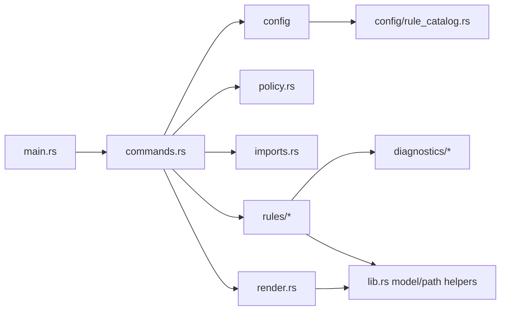

# Refactoring Analysis: OnionCry Post-Split Audit

> **Date**: 2026-07-03
> **Scope**: Full Rust source tree after the module split in `src/config`, `src/diagnostics`, `src/rules/clean_boundaries`, and `src/rules/feature_system`; integration tests sampled with full structure scan.
> **Analyzed by**: AI-assisted refactoring analysis using Martin Fowler's code-smell catalog.
> **Language/Stack**: Rust CLI, `clap`, `serde`, JSONC config, Oxc parser for JavaScript/TypeScript import extraction.
> **Test Coverage**: 82 CLI/integration tests observed in `tests/check_cli.rs`; `make verify` should remain the delivery gate for any refactor.

---

## Executive Summary

The previous split removed the largest single-file bottlenecks, but several change-preventing structures remain. The highest-impact issue is now rule metadata and rule registration being scattered across `lib.rs`, `config/rule_catalog.rs`, `render.rs`, `commands.rs`, diagnostics, and tests. The next refactoring wave should introduce a rule registry/descriptor concept, split the integration test suite by command/rule family, and move public data types plus path helpers out of `src/lib.rs`.

| Severity      | Count  |
| ------------- | ------ |
| Critical (P0) | 0      |
| High (P1)     | 3      |
| Medium (P2)   | 5      |
| Low (P3)      | 3      |
| **Total**     | **11** |

### Top Opportunities

| #   | Finding                                                  | Location                                                                                      | Effort      | Impact                                                              |
| --- | -------------------------------------------------------- | --------------------------------------------------------------------------------------------- | ----------- | ------------------------------------------------------------------- |
| 1   | Centralize rule metadata and rule registration           | `src/lib.rs:67`, `src/config/rule_catalog.rs:146`, `src/render.rs:351`, `src/commands.rs:152` | significant | Reduces shotgun surgery when adding or changing rules               |
| 2   | Split integration tests by command/rule family           | `tests/check_cli.rs:57`                                                                       | moderate    | Makes regressions easier to localize and lowers merge-conflict risk |
| 3   | Move public API types and path utilities out of `lib.rs` | `src/lib.rs:67-562`                                                                           | moderate    | Shrinks the crate root and makes dependencies explicit              |
| 4   | Split renderers by output mode                           | `src/render.rs:34-430`                                                                        | moderate    | Separates pretty, explain, LLM, and rule explanation changes        |
| 5   | Decompose Clean Architecture artifact placement policy   | `src/rules/clean_architecture.rs:90-529`                                                      | moderate    | Makes the most complex remaining rule easier to extend safely       |

---

## Findings

### P1 - High

#### F1: Rule Metadata Is Scattered Across Multiple Subsystems

- **Smell**: Shotgun Surgery, Duplicated Data, Repeated Switches
- **Category**: Change Preventer / DRY Violation
- **Location**: `src/lib.rs:67-95`, `src/config/rule_catalog.rs:146-266`, `src/render.rs:351-430`, `src/commands.rs:152-302`
- **Severity**: High
- **Impact**: Adding or changing a rule requires remembering several disconnected locations: rule id constants, known-rule display, canonical aliases, default severity, architecture-mode family, collector registration, diagnostic constructor, rule explanation, and tests.

**Current Code** (simplified):

```rust
const RULE_FEATURE_SYSTEM_QUERY_CONTRACT: &str = "frontend/feature-system-query-contract";

fn canonical_rule_name(rule: &str) -> Result<&'static str> {
    match rule {
        RULE_FEATURE_SYSTEM_QUERY_CONTRACT => RULE_FEATURE_SYSTEM_QUERY_CONTRACT,
        _ => Err(OnionCryError::UnknownRule { ... }),
    }
}

fn default_rule_severity(rule: &str) -> Severity {
    match rule {
        RULE_FEATURE_SYSTEM_QUERY_CONTRACT => Severity::Off,
        _ => Severity::Warn,
    }
}

fn violation_rule_explanation(rule: &str) -> &'static str {
    match rule {
        RULE_FEATURE_SYSTEM_QUERY_CONTRACT => "...",
        _ => "...",
    }
}
```

**Recommended Refactoring**: Introduce Parameter Object / Replace Repeated Switches with Data Table.

**After** (proposed):

```rust
pub(crate) struct RuleDescriptor {
    pub id: &'static str,
    pub legacy_aliases: &'static [&'static str],
    pub default_severity: Severity,
    pub architecture_family: Option<ArchitectureRuleFamily>,
    pub explanation: &'static str,
}

pub(crate) const RULES: &[RuleDescriptor] = &[
    RuleDescriptor {
        id: "frontend/feature-system-query-contract",
        legacy_aliases: &[],
        default_severity: Severity::Off,
        architecture_family: None,
        explanation: "Feature system query contracts keep TanStack Query ownership in lib.",
    },
];
```

**Rationale**: A rule descriptor makes the linter-style rule catalog explicit and reduces the number of files that must change for every new rule.

---

#### F2: Integration Test Suite Is a Large, Mixed Module

- **Smell**: Large Module, Duplicated Code, Divergent Change
- **Category**: Bloater / Change Preventer
- **Location**: `tests/check_cli.rs:57-4689`
- **Severity**: High
- **Impact**: The single test file contains config writers, CLI helpers, init/check/explain tests, Clean Architecture tests, Vertical Slice tests, repo rules, code-smell rules, and frontend feature-system rules. This increases merge conflicts and makes it hard to run or reason about one rule family.

**Current Code** (simplified):

```rust
fn write_layer_config(path: &Path) { ... }
fn write_context_policy_config(path: &Path) { ... }
fn write_feature_system_query_contract_config(path: &Path, rule_json: &str) { ... }

#[test]
fn check_reports_layer_leaks_for_type_only_imports_and_reexports() { ... }

#[test]
fn check_reports_feature_system_query_contract_violations() { ... }
```

**Recommended Refactoring**: Extract Module, Extract Test Fixture Builder.

**After** (proposed):

```text
tests/
  support/mod.rs
  support/workspace.rs
  cli_init.rs
  cli_check.rs
  clean_architecture.rs
  vertical_slice.rs
  repo_rules.rs
  feature_system.rs
  explain.rs
```

```rust
let workspace = TestWorkspace::new()
    .with_config(ConfigFixture::clean_architecture())
    .with_file("src/application/use-case.ts", "...");

let result = workspace.check_json_failure();
```

**Rationale**: The tests are valuable and should stay behavior-oriented, but they need a structure that mirrors the rule families and CLI commands.

---

#### F3: `src/lib.rs` Is Still a Crate-Root Hub

- **Smell**: Large Module, Divergent Change, Primitive Obsession
- **Category**: Bloater / Change Preventer
- **Location**: `src/lib.rs:17-562`
- **Severity**: High
- **Impact**: The crate root re-exports config, commands, imports, renderers, rule internals, public DTOs, rule names, errors, and path helpers. The widespread `use crate::*` pattern makes it hard to see module dependencies and encourages unrelated code to depend on crate-root internals.

**Current Code** (simplified):

```rust
pub use config::{Config, LoadedConfig, RuleSetting, Severity};
pub use commands::{run_check, run_explain};
pub use render::{build_report, render_llm, render_pretty};

const RULE_NO_LAYER_LEAK: &str = "cleanarch/no-layer-leak";

pub struct Violation { ... }

fn project_relative_components(project_root: &Path, path: &Path) -> Vec<String> { ... }
```

**Recommended Refactoring**: Extract Module, Move Function, Replace Primitive with Object for rule ids.

**After** (proposed):

```text
src/
  lib.rs
  errors.rs
  model.rs
  rules/catalog.rs
  path_utils.rs
```

```rust
pub use commands::{run_check, run_explain};
pub use errors::{OnionCryError, Result};
pub use model::{CheckReport, Violation, ImportEdge};
```

**Rationale**: Keep `lib.rs` as a public facade. Move domain data types, errors, rule catalog, and path utilities to cohesive modules.

---

### P2 - Medium

#### F4: `collect_all_violations` Manually Orchestrates Every Rule

- **Smell**: Long Function, Repeated Switches, Shotgun Surgery
- **Category**: Change Preventer / Conditional Complexity
- **Location**: `src/commands.rs:152-302`
- **Severity**: Medium
- **Impact**: Rule collection is centralized as a long list of imports and calls. Adding a rule requires editing `commands.rs` even when the rule belongs to a self-contained module.

**Current Code** (simplified):

```rust
match loaded.config.architecture.mode {
    ArchitectureMode::CleanArchitecture => {
        violations.extend(collect_layer_violations(...)?);
        violations.extend(collect_context_violations(...)?);
        violations.extend(collect_clean_artifact_placement_violations(...)?);
    }
    ArchitectureMode::VerticalSlice => {
        violations.extend(collect_vertical_slice_internal_import_violations(...)?);
    }
}
violations.extend(collect_path_naming_violations(...)?);
```

**Recommended Refactoring**: Introduce Rule Collector Registry.

**After** (proposed):

```rust
for collector in rule_collectors_for(loaded.config.architecture.mode) {
    violations.extend(collector.collect(&ctx)?);
}
```

**Rationale**: A collector registry aligns with the rule descriptor catalog and keeps command execution separate from rule inventory.

---

#### F5: Renderers and Rule Explanations Share One Module

- **Smell**: Large Module, Divergent Change
- **Category**: Bloater / Change Preventer
- **Location**: `src/render.rs:34-430`
- **Severity**: Medium
- **Impact**: Pretty output, explain output, LLM grouping, sort helpers, and rule explanations change for different reasons but live in one file.

**Recommended Refactoring**: Extract Module.

**After** (proposed):

```text
src/render/
  mod.rs
  report.rs
  pretty.rs
  explain.rs
  llm.rs
  rule_explanations.rs
```

**Rationale**: Output modes are public CLI behavior; splitting them lowers regression risk and keeps snapshots/assertions easier to target.

---

#### F6: Clean Artifact Placement Policy Still Has Multiple Responsibilities

- **Smell**: Large Module, Long Function, Conditional Complexity
- **Category**: Bloater / Conditional Complexity
- **Location**: `src/rules/clean_architecture.rs:90-529`
- **Severity**: Medium
- **Impact**: One policy handles config normalization, artifact classification, context-first detection, layer-first migration heuristics, group recommendations, and expected-boundary rendering.

**Recommended Refactoring**: Split Phase, Extract Class/Module.

**After** (proposed):

```text
src/rules/clean_architecture/
  mod.rs
  artifact_policy.rs
  artifact_classifier.rs
  location.rs
  boundary_renderer.rs
  file_index.rs
```

**Rationale**: This is the most complex remaining rule. Splitting classification from recommendation rendering will make later Clean Architecture layout changes safer.

---

#### F7: Feature System Query Contract Has a Long Analysis-Orchestration Method

- **Smell**: Long Function, Data Clumps, Duplicated Code
- **Category**: Bloater / DRY Violation
- **Location**: `src/rules/feature_system/query_contract.rs:72-166`, `src/rules/feature_system/query_contract.rs:371-389`
- **Severity**: Medium
- **Impact**: `violations` builds source maps, marks query requirements, validates required files, checks query-options files, checks hooks, and checks route-owned query keys. The import predicates differ only by target condition.

**Recommended Refactoring**: Split Phase, Introduce Parameter Object.

**After** (proposed):

```rust
let analysis = QueryContractAnalysis::build(project_root, files, edges, &source_by_file, self);
violations.extend(analysis.required_file_violations(severity));
violations.extend(analysis.query_options_violations(severity));
violations.extend(analysis.hook_violations(severity));
violations.extend(analysis.route_query_key_violations(severity));
```

**Rationale**: Preserve the policy API while making each observable rule in the query contract individually testable.

---

#### F8: Wildcard Imports Hide Coupling

- **Smell**: Insider Trading, Hidden Dependencies
- **Category**: Coupler
- **Location**: `src/**/*.rs` with repeated `use crate::*`
- **Severity**: Medium
- **Impact**: Most modules import the whole crate root. This makes coupling look lower than it is, hides unused conceptual dependencies, and makes future module moves harder.

**Recommended Refactoring**: Replace Wildcard Import with Explicit Imports.

**After** (proposed):

```rust
use crate::{
    ImportEdge, ImportResolution, LoadedConfig, RulePolicy, Severity, Violation,
    RULE_NO_LAYER_LEAK,
};
```

**Rationale**: This can be done gradually and mechanically after `lib.rs` is split.

---

### P3 - Low

| #   | Smell                                  | Location                                      | Technique                                   | Notes                                                                                                                    |
| --- | -------------------------------------- | --------------------------------------------- | ------------------------------------------- | ------------------------------------------------------------------------------------------------------------------------ |
| F9  | Duplicated Code                        | `src/diagnostics/clean_architecture.rs:5-387` | Extend Builder                              | The new builder is only used in simple diagnostics; Clean Architecture diagnostics still repeat many `Violation` fields. |
| F10 | Lazy/Mixed Module                      | `src/rules/repo.rs:1-322`                     | Extract Module                              | Split `test_placement.rs` and `path_naming.rs` when these rules grow again.                                              |
| F11 | Guarded `expect` in internal algorithm | `src/rules/clean_boundaries/cycle.rs:145-180` | Introduce Assertion / Encapsulate Invariant | These are Tarjan invariants and not user input paths, so low priority.                                                   |

---

## Coupling Analysis

### Module Dependency Map



### High-Risk Coupling

| Module                       | Risk   | Reason                                                                                       |
| ---------------------------- | ------ | -------------------------------------------------------------------------------------------- |
| `src/lib.rs`                 | High   | Crate root owns public types, private helpers, rule ids, and reexports used by most modules. |
| `src/commands.rs`            | High   | Depends on every rule collector and decides which rule family runs.                          |
| `src/config/rule_catalog.rs` | Medium | Knows aliases, default severities, and architecture-mode families.                           |
| `src/render.rs`              | Medium | Knows report rendering and rule explanations.                                                |
| `tests/check_cli.rs`         | High   | Every feature family changes one integration test file.                                      |

### Circular Dependencies

None detected in Rust module structure. The main issue is hidden coupling through `use crate::*`, not a literal module cycle.

---

## DRY Analysis

### Duplicated Code Clusters

| Cluster                         | Locations                                                                         | Extraction Strategy                                      |
| ------------------------------- | --------------------------------------------------------------------------------- | -------------------------------------------------------- |
| Rule metadata                   | `src/lib.rs:67-95`, `src/config/rule_catalog.rs:146-266`, `src/render.rs:351-430` | Introduce `RuleDescriptor` catalog.                      |
| Test config writers             | `tests/check_cli.rs:57-514`                                                       | Introduce fixture builder and split support helpers.     |
| Diagnostic object fields        | `src/diagnostics/clean_architecture.rs:5-387`                                     | Extend `ViolationBuilder` for import-backed diagnostics. |
| Feature query import predicates | `src/rules/feature_system/query_contract.rs:371-389`                              | Extract `imports_matching_system_location` predicate.    |

### Magic Values

Rule ids are currently string constants, which is acceptable for public linter-style rule names. The problem is not the constants themselves; it is that rule metadata is split across several match expressions.

---

## SOLID Analysis

> **Context**: OnionCry is a Rust CLI with an explicit architecture-rule domain, but it is not an object-oriented DDD application with entities, aggregates, or repositories. SOLID is partially applicable at the module level, especially SRP and DIP-like dependency direction. LSP and ISP are not meaningful here.

| Principle | Finding                                                   | Location                  | Severity | Recommendation                                                     |
| --------- | --------------------------------------------------------- | ------------------------- | -------- | ------------------------------------------------------------------ |
| SRP       | Crate root has multiple reasons to change                 | `src/lib.rs:17-562`       | High     | Split errors, model types, rule catalog, and path utilities.       |
| SRP       | `commands.rs` mixes command execution and rule inventory  | `src/commands.rs:152-302` | Medium   | Move rule registration into a collector registry.                  |
| DIP-like  | Rules and renderers depend on crate-root wildcard imports | `src/**/*.rs`             | Medium   | Split `lib.rs`, then replace `use crate::*` with explicit imports. |

---

## Suggested Refactoring Order

### Phase 1: Quick Wins

1. Split `src/rules/repo.rs` into `repo/test_placement.rs` and `repo/path_naming.rs`.
2. Extract feature-system query import predicates from `query_contract.rs`.
3. Expand `ViolationBuilder` for the remaining simple Clean Architecture diagnostics.

### Phase 2: High-Impact Structural Changes

1. Introduce `RuleDescriptor` and migrate rule id, aliases, default severities, architecture family, and explanation text into one catalog.
2. Refactor `collect_all_violations` behind a rule collector registry.
3. Split `tests/check_cli.rs` by command/rule family with shared `tests/support`.

### Phase 3: Deeper Cleanup

1. Split `src/lib.rs` into `errors.rs`, `model.rs`, `path_utils.rs`, and `rules/catalog.rs`.
2. Split `src/render.rs` by output mode.
3. Decompose Clean Architecture artifact placement into classifier, location, boundary renderer, and file index modules.

### Prerequisites

- Keep `rtk make verify` as the gate after each phase.
- Do the rule descriptor before collector registry; the registry should reuse catalog metadata.
- Split tests before changing behavior-heavy rules, so failures localize better.

---

## Risks and Caveats

- Do not change rule ids or diagnostic text while moving metadata; both are CLI/user-facing contracts.
- The test split should preserve behavioral assertions, not turn into unit tests of mocks.
- `src/rules/clean_architecture.rs` is complex because it encodes migration-friendly layout heuristics; split it without changing recommendations.
- `use crate::*` removal is safer after `lib.rs` is decomposed, otherwise imports may churn twice.

---

## Appendix: Smell Distribution

| Category                    | Count |
| --------------------------- | ----- |
| Bloaters                    | 4     |
| Change Preventers           | 3     |
| Dispensables                | 1     |
| Couplers                    | 1     |
| Conditional Complexity      | 1     |
| DRY Violations              | 2     |
| SOLID Module-Level Findings | 3     |

